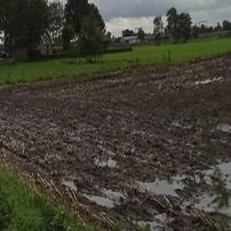

# Space2Ground Dataset


Space2Ground is a multi-level, multi-sensor, multi-modal dataset, annotated with grassland/non-grassland labels for agriculture monitoring. We combine Sentinel-1 SAR data, Sentinel-2 multispectral data and street-level images for the purpose of grassland detection.

In particular, our dataset consists of:
* Space Component
  * Sentinel-1 monthly mean time-series 
  * Sentinel-2 time-series
* Ground Component
  * Street level image patches obtained from [Mapillary](https://www.mapillary.com/app) street-level images after appropriate processing
* Labels/Annotations
  * Parcel IDs and Grassland/Non-Grassland labels, according to farmers' declarations (_parcel\_annotations.csv file_)

<br clear="right"/>


## Downloading Space2Ground through direct links
To download Space2Ground, you can use the following links, taken from [the corresponding page of the dataset on Zenodo](https://zenodo.org/record/6458006):
* Sentinel-1 and Sentinel-2 analysis ready data [(download link)](https://zenodo.org/record/6458006/files/Sentinel_Data.zip)
  * _file size: ~120MB zipped -> ~300MB when unzipped_
* Street-level image patches [(download link)](https://zenodo.org/record/6458006/files/StreetLevelImages.zip)
  * _file size: ~190MB zipped -> ~210MB when unzipped_
* (Optional) - Raw/Initial set of street-level images [(download link)](https://zenodo.org/record/5846417/files/mapillary.zip)
  * _file size: ~4.6GB zipped -> ~4.7GB unzipped_
<br/><br/>


## Downloading Space2Ground through the provided download script
An alternative way to download Space2Ground, is to use the `download.sh` script included in this repository. The instructions for the script usage are as follows:
1. download Sentinel data to `data/` (~ 115MB)
  ```bash
  bash download.sh sentinel
  ```
2. download Street level patches to `data/streetLevel_patches` (~ 187MB)
```bash
bash download.sh imagepatches
```
3. (Optional) download Street level raw images to `data/Mapillary` (~ 4.6GB)
```bash
bash download.sh mapillary
```
or download everything with `bash download.sh all`
<br/><br/>

## Dataset structure
By downloading and unzipping the components, the file structure should look as follows:
```
├── Mapillary (optional)
│   └── mapillary
│       ├── 1000364310368104.jpg
│       ├── 1000636817135431.jpg
|       ... (~ 38000 more images)
├── s1
│   ├── test_dataset.csv
│   └── train_dataset.csv
├── s2
│   ├── test_dataset.csv
│   └── train_dataset.csv
└── streetLevel_patches
    ├── test
    │   ├── Grassland
    │   │   ├── 1021749698360014_right.jpg
    │   │   ├── 1076131292797553_left.jpg
    │   │   ... (~ 1900 more images)
    │   └── Non_Grassland
    │   │   ├── 1003028817110323_right.jpg
    │   │   ├── 1074590653065936_left.jpg
    │   │   ... (~ 320 more images)
    └── train
        ├── Grassland
        │   ├── 1003976380345602_right.jpg
        │   ├── 1005946389941606_left.jpg
        │   ... (~ 6950 more images)
        └── Non_Grassland
            ├── 1005486846651292_left.jpg
            ├── 1019023345502754_right.jpg
            ... (~ 900 more images)
```

## Details for each data component

### Sentinel-1 data
The following table is a 2-row sample of the Sentinel-1 csv data columns and how they look like
| label | id | 2017-04_VH_SAR | 2017-04_VV_SAR | 2017-05_VH_SAR | 2017-05_VV_SAR | ... |
| ----- | -- | --- | --- | --- | --- | --- |
| 1 | 38267 | 3.880000039935112000e-01 | 3.217499963939189911e-01 | 3.055000031987826214e-01 | 2.696666667858759747e-01 | ... |
| 0 | 12914 | 1.291400000000000000e+04 | 3.467499986290931702e-01 | 2.702500000596046448e-01 | 2.591666653752326965e-01 | ... |
| ... |

The full list of column names of the Sentinel 1 data is:
```python
s1_colnames = ['label', 'parcel_id', '2017-04_VH_SAR', '2017-04_VV_SAR', '2017-05_VH_SAR',
    '2017-05_VV_SAR', '2017-06_VH_SAR', '2017-06_VV_SAR', '2017-07_VH_SAR',
    '2017-07_VV_SAR', '2017-08_VH_SAR', '2017-08_VV_SAR', '2017-09_VH_SAR',
    '2017-09_VV_SAR', '2017-10_VH_SAR', '2017-10_VV_SAR', '2017-04_VH_COH',
    '2017-04_VV_COH', '2017-05_VH_COH', '2017-05_VV_COH', '2017-06_VH_COH',
    '2017-06_VV_COH', '2017-07_VH_COH', '2017-07_VV_COH', '2017-08_VH_COH',
    '2017-08_VV_COH', '2017-09_VH_COH', '2017-09_VV_COH', '2017-10_VH_COH',
    '2017-10_VV_COH']
```

### Sentinel-2 data
The following table is a 2-row sample of the Sentinel-2 csv data columns and how they look like
| label | id | B02_2017-03-24 | B02_2017-03-27 | ... | B8A_2017-03-24 | ... |
| ----- | -- | --- | --- | --- | --- | --- |
| 1 | 12914 | 1.877940319825072701e-01 | 2.718666706611517214e-01 | ... | 3.002316555825695898e-01 | ... |
| 0 | 41660 | 1.720458268082157016e-01 | 2.467546732731773496e-01 | ... | 1.456669014803818607e-01 | ... |
| ... |

The full list of column names of the Sentinel 2 data is:
```python
s2_colnames = ['label', 'id', 'B02_2017-03-24', 'B02_2017-03-27', 'B02_2017-04-26', 'B02_2017-05-06', 'B02_2017-05-26' 
    'B02_2017-06-02', 'B02_2017-06-05', 'B02_2017-07-07', 'B02_2017-07-17', 'B02_2017-07-20', 'B02_2017-07-22',
    'B02_2017-08-04', 'B02_2017-08-06', 'B02_2017-08-09', 'B02_2017-08-14', 'B02_2017-08-19', 'B02_2017-08-24',
    'B02_2017-08-26', 'B02_2017-08-29', 'B02_2017-09-03', 'B02_2017-09-10', 'B02_2017-09-15', 'B02_2017-09-20',
    'B02_2017-09-23', 'B02_2017-09-28', 'B02_2017-10-03', 'B02_2017-10-05', 'B02_2017-10-15', 'B02_2017-10-18',
    'B03_2017-03-24', 'B03_2017-03-27', 'B03_2017-04-26', 'B03_2017-05-06', 'B03_2017-05-26', 'B03_2017-06-02',
    'B03_2017-06-05', 'B03_2017-07-07', 'B03_2017-07-17', 'B03_2017-07-20', 'B03_2017-07-22', 'B03_2017-08-04',
    'B03_2017-08-06', 'B03_2017-08-09', 'B03_2017-08-14', 'B03_2017-08-19', 'B03_2017-08-24', 'B03_2017-08-26',
    'B03_2017-08-29', 'B03_2017-09-03', 'B03_2017-09-10', 'B03_2017-09-15', 'B03_2017-09-20', 'B03_2017-09-23',
    'B03_2017-09-28', 'B03_2017-10-03', 'B03_2017-10-05', 'B03_2017-10-15', 'B03_2017-10-18', 'B04_2017-03-24',
    'B04_2017-03-27', 'B04_2017-04-26', 'B04_2017-05-06', 'B04_2017-05-26', 'B04_2017-06-02', 'B04_2017-06-05',
    'B04_2017-07-07', 'B04_2017-07-17', 'B04_2017-07-20', 'B04_2017-07-22', 'B04_2017-08-04', 'B04_2017-08-06',
    'B04_2017-08-09', 'B04_2017-08-14', 'B04_2017-08-19', 'B04_2017-08-24', 'B04_2017-08-26', 'B04_2017-08-29',
    'B04_2017-09-03', 'B04_2017-09-10', 'B04_2017-09-15', 'B04_2017-09-20', 'B04_2017-09-23', 'B04_2017-09-28',
    'B04_2017-10-03', 'B04_2017-10-05', 'B04_2017-10-15', 'B04_2017-10-18', 'B05_2017-03-24', 'B05_2017-03-27',
    'B05_2017-04-26', 'B05_2017-05-06', 'B05_2017-05-26', 'B05_2017-06-02', 'B05_2017-06-05', 'B05_2017-07-07',
    'B05_2017-07-17', 'B05_2017-07-20', 'B05_2017-07-22', 'B05_2017-08-04', 'B05_2017-08-06', 'B05_2017-08-09',
    'B05_2017-08-14', 'B05_2017-08-19', 'B05_2017-08-24', 'B05_2017-08-26', 'B05_2017-08-29', 'B05_2017-09-03',
    'B05_2017-09-10', 'B05_2017-09-15', 'B05_2017-09-20', 'B05_2017-09-23', 'B05_2017-09-28', 'B05_2017-10-03',
    'B05_2017-10-05', 'B05_2017-10-15', 'B05_2017-10-18', 'B06_2017-03-24', 'B06_2017-03-27', 'B06_2017-04-26',
    'B06_2017-05-06', 'B06_2017-05-26', 'B06_2017-06-02', 'B06_2017-06-05', 'B06_2017-07-07', 'B06_2017-07-17',
    'B06_2017-07-20', 'B06_2017-07-22', 'B06_2017-08-04', 'B06_2017-08-06', 'B06_2017-08-09', 'B06_2017-08-14',
    'B06_2017-08-19', 'B06_2017-08-24', 'B06_2017-08-26', 'B06_2017-08-29', 'B06_2017-09-03', 'B06_2017-09-10',
    'B06_2017-09-15', 'B06_2017-09-20', 'B06_2017-09-23', 'B06_2017-09-28', 'B06_2017-10-03', 'B06_2017-10-05',
    'B06_2017-10-15', 'B06_2017-10-18', 'B07_2017-03-24', 'B07_2017-03-27', 'B07_2017-04-26', 'B07_2017-05-06',
    'B07_2017-05-26', 'B07_2017-06-02', 'B07_2017-06-05', 'B07_2017-07-07', 'B07_2017-07-17', 'B07_2017-07-20',
    'B07_2017-07-22', 'B07_2017-08-04', 'B07_2017-08-06', 'B07_2017-08-09', 'B07_2017-08-14', 'B07_2017-08-19',
    'B07_2017-08-24', 'B07_2017-08-26', 'B07_2017-08-29', 'B07_2017-09-03', 'B07_2017-09-10', 'B07_2017-09-15',
    'B07_2017-09-20', 'B07_2017-09-23', 'B07_2017-09-28', 'B07_2017-10-03', 'B07_2017-10-05', 'B07_2017-10-15',
    'B07_2017-10-18', 'B08_2017-03-24', 'B08_2017-03-27', 'B08_2017-04-26', 'B08_2017-05-06', 'B08_2017-05-26',
    'B08_2017-06-02', 'B08_2017-06-05', 'B08_2017-07-07', 'B08_2017-07-17', 'B08_2017-07-20', 'B08_2017-07-22',
    'B08_2017-08-04', 'B08_2017-08-06', 'B08_2017-08-09', 'B08_2017-08-14', 'B08_2017-08-19', 'B08_2017-08-24',
    'B08_2017-08-26', 'B08_2017-08-29', 'B08_2017-09-03', 'B08_2017-09-10', 'B08_2017-09-15', 'B08_2017-09-20',
    'B08_2017-09-23', 'B08_2017-09-28', 'B08_2017-10-03', 'B08_2017-10-05', 'B08_2017-10-15', 'B08_2017-10-18',
    'B8A_2017-03-24', 'B8A_2017-03-27', 'B8A_2017-04-26', 'B8A_2017-05-06', 'B8A_2017-05-26', 'B8A_2017-06-02',
    'B8A_2017-06-05', 'B8A_2017-07-07', 'B8A_2017-07-17', 'B8A_2017-07-20', 'B8A_2017-07-22', 'B8A_2017-08-04',
    'B8A_2017-08-06', 'B8A_2017-08-09', 'B8A_2017-08-14', 'B8A_2017-08-19', 'B8A_2017-08-24', 'B8A_2017-08-26',
    'B8A_2017-08-29', 'B8A_2017-09-03', 'B8A_2017-09-10', 'B8A_2017-09-15', 'B8A_2017-09-20', 'B8A_2017-09-23',
    'B8A_2017-09-28', 'B8A_2017-10-03', 'B8A_2017-10-05', 'B8A_2017-10-15', 'B8A_2017-10-18', 'B11_2017-03-24',
    'B11_2017-03-27', 'B11_2017-04-26', 'B11_2017-05-06', 'B11_2017-05-26', 'B11_2017-06-02', 'B11_2017-06-05',
    'B11_2017-07-07', 'B11_2017-07-17', 'B11_2017-07-20', 'B11_2017-07-22', 'B11_2017-08-04', 'B11_2017-08-06',
    'B11_2017-08-09', 'B11_2017-08-14', 'B11_2017-08-19', 'B11_2017-08-24', 'B11_2017-08-26', 'B11_2017-08-29',
    'B11_2017-09-03', 'B11_2017-09-10', 'B11_2017-09-15', 'B11_2017-09-20', 'B11_2017-09-23', 'B11_2017-09-28',
    'B11_2017-10-03', 'B11_2017-10-05', 'B11_2017-10-15', 'B11_2017-10-18', 'B12_2017-03-24', 'B12_2017-03-27',
    'B12_2017-04-26', 'B12_2017-05-06', 'B12_2017-05-26', 'B12_2017-06-02', 'B12_2017-06-05', 'B12_2017-07-07',
    'B12_2017-07-17', 'B12_2017-07-20', 'B12_2017-07-22', 'B12_2017-08-04', 'B12_2017-08-06', 'B12_2017-08-09',
    'B12_2017-08-14', 'B12_2017-08-19', 'B12_2017-08-24', 'B12_2017-08-26', 'B12_2017-08-29', 'B12_2017-09-03',
    'B12_2017-09-10', 'B12_2017-09-15', 'B12_2017-09-20', 'B12_2017-09-23', 'B12_2017-09-28', 'B12_2017-10-03',
    'B12_2017-10-05', 'B12_2017-10-15', 'B12_2017-10-18']
```

### Street-level patches data
These are cropped vegetation parts of mapillary street-level images. The methodology of creating these images is described [in our Space2Ground paper](#space2ground_paper).

* The label of each image (Grassland/Non-Grassland) can be derived either
  * by the folder in which it belongs to (see [Dataset Structure](#dataset-structure) section)
  * by the mappings provided in the [parcel_annotations.csv](parcel_annotations.csv) file
* The `left` and `right` parts of each filename correspond to the information related to the side of the image that the parcel is located. This information is useful for the front-facing acquisitions, where the road ahead separates the parcels on the left and right.

Samples of Grassland patches:<br/>


<br/>

Samples of Non-Grassland patches:<br/>




### Parcel annotations
This is a csv file that contains the annotations that connect all the Space2Ground dataset components, as it holds information on the parcel id and the street level image id. Its structure is as follows:<br/>
| id | label | image_date | image_id | direction |
| -- | ----- | ---------- | -------- | --------- |
| 1890 | Grassland | 2017-08-02 | 527903208225456 | right |
| 28235 | Grassland | 2017-08-05 | 485698512854670 | left |
| 34666 | Maize | 2017-08-13 | 306183544216406 | left |
| ... |

Note that the labels include crop types, like `Grassland`, `Maize`, `Onions`, etc. The Grassland/Non-Grassland differentiation has been generated by processing the labels accordingly.

## Space2Ground Usage examples and Dataset Generation

### Usage example
The implementation of our [publication](#space2ground_paper) using Space2Ground dataset can be found in [this jupyter notebook](#notebook_to_be_added)

### Image patches from raw Mapillary images example
The process we followed to extract the vegetation patches from the "raw" Mapillary dataset can be found in [this jupyter notebook](streetLevel_patches.ipynb)


## External Code
* Download street level images from Mapillary and annotate them with labels from LPIS
https://github.com/Agri-Hub/Callisto/tree/main/Mapillary

* Download and pre-process Sentinel-1 and Sentinel-2 data:
https://github.com/Agri-Hub/ADC


## References
<a id="space2ground_paper">[1]</a>
George Choumos, Alkiviadis Koukos, Vasileios Sitokonstantinou and Charalampos Kontoes (2022) <br/>
_Towards Space-to-Ground Data Availability for Agriculture Monitoring_ <br/>
2022 IEEE 14th Image, Video, and Multidimensional Signal Processing Workshop (IVMSP 2022), 26-29 June 2022, Nafplio, Greece
https://arxiv.org/abs/2205.07721

## Citation
If you used Space2Ground dataset, please cite the following paper.
```bibtex
@misc{https://doi.org/10.48550/arxiv.2205.07721,
  doi = {10.48550/ARXIV.2205.07721},
  url = {https://arxiv.org/abs/2205.07721},
  author = {Choumos, George and Koukos, Alkiviadis and Sitokonstantinou, Vasileios and Kontoes, Charalampos},
  keywords = {Computer Vision and Pattern Recognition (cs.CV), Machine Learning (cs.LG), Multimedia (cs.MM), FOS: Computer and information sciences, FOS: Computer and information sciences},
  title = {Towards Space-to-Ground Data Availability for Agriculture Monitoring},
  publisher = {arXiv},
  year = {2022},
  copyright = {arXiv.org perpetual, non-exclusive license}
}
```
